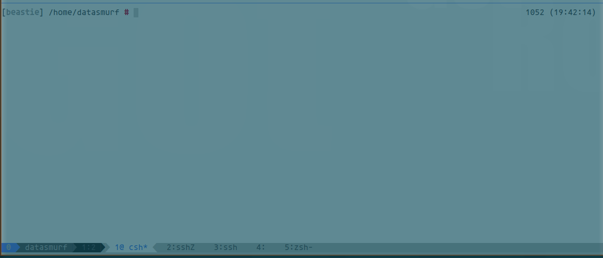

# bastille-autocomplete
tcsh autocompletion for BastilleBSD 

## installation

```bash
git clone https://github.com/ddowse/bastille-autocomplete
source bastille.complete 
```
or

```bash
fetch https://raw.githubusercontent.com/ddowse/bastille-autocomplete/main/bastille.complete
source bastille.complete 
```




Please report bugs. Thanks and enjoy.
